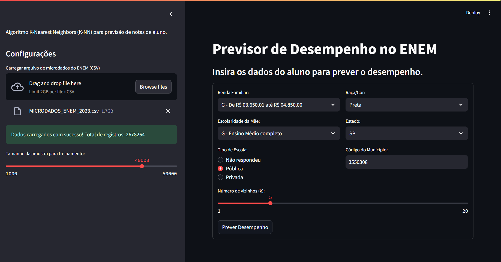

# Previsor de Desempenho no ENEM



Este projeto utiliza o algoritmo K-Nearest Neighbors (KNN) para prever as notas de um aluno no ENEM a partir dos microdados oficiais. A aplicação foi desenvolvida com Streamlit, permitindo uma interface interativa para a inserção de dados e visualização dos resultados.

---

1. Instalação das dependências:

    ```bash
    pip install pandas streamlit scikit-learn
    ```

2. Iniciar a aplicação:

    ```bash
    streamlit run main.py --server.maxUploadSize 2048
    ```

3. Utilização:

    - Carregue o arquivo CSV com os microdados do ENEM e aguarde alguns instantes até que a análise inicial seja concluída.

    - Preencha os dados do aluno na interface.

    - Aguarde a previsão das notas e a comparação com os vizinhos mais próximos.

---

## Principais Funcionalidades

- **Carregamento e Preparação dos Dados:**
  Lê o arquivo CSV contendo os microdados do ENEM, seleciona as colunas necessárias e remove as linhas com valores nulos nas notas.

---

- **Pré-processamento dos Dados:**
  Separa os dados em variáveis independentes (features) e dependentes (targets) e aplica a conversão de variáveis categóricas para numéricas (one-hot encoding).

---

- **Criação e Treinamento dos Modelos**
  Cria pipelines para cada área do conhecimento (Matemática, Ciências da Natureza, Linguagens, Ciências Humanas e Redação) utilizando:

  - Imputação de valores ausentes com a média.

  - Normalização dos dados.

  - Regressão KNN para previsão.

---

- **Previsão e Obtenção dos Vizinhos Mais Próximos:**
  Realiza a previsão das notas para um novo aluno e, em paralelo, identifica os vizinhos mais próximos para comparar as médias.

---

- **Interface Interativa com Streamlit:**
  A interface permite o upload do arquivo CSV, entrada dos dados do aluno e visualização dos resultados de forma simples e intuitiva.

---

Explicação do código do arquivo `main.py`:

Com o método `carregar_dados`, fiz a leitura do arquivo com o Pandas e a remoção das linhas com valores nulos.

Com o método `preparar_dados`, selecionei as colunas para treinamento do modelo, me atentando as Variáveis Independentes e Dependentes. No caso das Variáveis Independentes, por conterem valores tanto qualitativos, quanto quantitativos, precisei converter o valores qualitativos em valores numéricos, através do comando `pd.get_dummies(X, drop_first=True)`.

Com o método `criar_modelos`, iniciei minhas Pipelines com imputação de valores ausentes, normalizações e KNN, e para cada área do conhecimento (matemática, ciências, etc) treinei os modelos com o `pipeline.fit`.

Com o método `prever_notas`, pude prever as notas do novo aluno para cada área do conhecimento.

Com o método `obter_vizinhos`, utilizando os modelos criados, foi possível obter os vizinhos mais próximos (NearestNeighbors) para cada dado do novo aluno. Após isso, obtive o índice para cada ponto (`kneighbors`) do modelo e dos dados do novo aluno. Por último, localizo no DataFrame inicial (csv) as informações de cada vizinho.

Com o método `interface_entrada`, pude definir a interface com o formulário para entrada dos dados do novo aluno que serão utilizados para previsão.

Com o método `main`, fiz a chamada de todos os métodos anteriores para exibir os resultados e criei as visualizações para as previsões.
